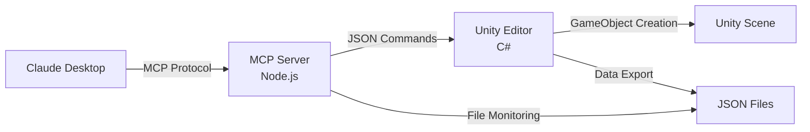

# Unity MCP Learning 🎮🤖
*by orlab*

**Claude DesktopからUnity Editorを自然言語で操作できる革新的なMCPサーバー**

[](https://unity.com/)
[](https://nodejs.org/)
[](https://www.typescriptlang.org/)
[](https://modelcontextprotocol.io/)

## 🌟 概要

Unity MCP Learningは、**Claude Desktop**と**Unity Editor**をリアルタイムで連携させ、自然言語でGameObjectの作成やUnity操作を可能にするMCP（Model Context Protocol）サーバーの学習プロジェクトです。

### ✨ 実現できること

```bash
Claude Desktop> create a cube
✅ Unity Command executed successfully: Cube 'Cube' created at (0, 0, 0)
# → Unityシーンに即座にCubeが作成されます！
```

- 🗣️ **自然言語操作**: `create a red cube` でUnityにオブジェクト作成
- ⚡ **リアルタイム連携**: Claude Desktop ↔ Unity Editor間の即座の通信  
- 🛡️ **堅牢なエラーハンドリング**: 詳細な検証とエラー分類システム
- 📊 **自動監視**: Unity状態の変更を自動検知・エクスポート
- 🎯 **非同期処理**: パフォーマンス最適化された実装

## 🚀 クイックスタート

### **🏃‍♂️ 5分で体験**
```bash
# 1. Unity プロジェクト開く
# Unity Hub → Add → MCPLearning フォルダ選択

# 2. MCPサーバー起動
cd unity-mcp-node
npm install && npm run build

# 3. Claude Desktop でテスト
# "ping" → "create a cube" → "get scene info"
```

詳細は **[5分クイックスタートガイド](docs/tutorial/08-quick-start-guide.md)** をご覧ください。

### **📚 完全学習**
段階的に学習したい方は **[チュートリアル](docs/tutorial/README.md)** から開始してください。

## 🎮 現在の機能

### **現在の状況**
- **Step 3 完了**: Claude Desktop ↔ Unity Editor 完全双方向制御システム確立
- **開発フェーズ**: 品質改善・テスト環境構築に注力
- **利用可能ツール**: 4種類のMCPツール実装済み

### **💬 利用可能なコマンド**

| コマンド | 動作 | 実行時間 | パラメータ |
|---------|------|---------|----------|
| `create a cube` | 立方体作成 | ~50-100ms | name, position, scale, color |
| `create a sphere` | 球体作成 | ~50-100ms | name, position, scale |
| `unity_info_realtime` | リアルタイム情報取得 | ~15ms | category (optional) |
| `ping` | 接続テスト | ~5ms | なし |

### **🔄 準備中の機能**
- `create_plane` - 平面作成（実装準備完了）
- `create_gameobject` - 空オブジェクト作成（実装準備完了）

### **📊 システム機能**
- ✅ **リアルタイム双方向通信**: Claude Desktop ↔ Unity Editor
- ✅ **自動データエクスポート**: Unity状態の変更検知・JSON出力（6種類）
- ✅ **包括的エラーハンドリング**: タイムアウト・検証・分類
- ✅ **非同期処理**: Task/await によるパフォーマンス最適化
- ✅ **Unity 6対応**: 最新APIとNamedBuildTarget使用
- 🔄 **テスト環境**: Jest・Unity Test Runner 設定中

## 🏗️ アーキテクチャ



## 📁 プロジェクト構成

```
UnityMCPLearning/
├── MCPLearning/              # Unity プロジェクト
│   ├── Assets/UnityMCP/      # MCP統合スクリプト
│   │   ├── Editor/Common/    # コマンドプロセッサー
│   │   ├── Editor/Exporters/ # データエクスポーター（6種類）
│   │   └── Tests/            # テストコード（新設）
│   └── UnityMCP/Data/        # エクスポートデータ（JSON）
├── unity-mcp-node/           # MCPサーバー（TypeScript）
│   ├── src/index.ts          # メインサーバーコード
│   ├── jest.config.js        # テスト設定
│   ├── dist/                 # ビルド済みファイル
│   └── mcp-config.json       # 設定ファイル
└── docs/                     # ドキュメント
    ├── development/          # 開発者向け（品質改善・テスト）
    ├── legal/                # 法的・セキュリティ文書
    ├── future/               # 将来計画・アイデア
    ├── prompt/               # AI設定ファイル
    └── tutorial/             # 学習用チュートリアル
```

## 📚 ドキュメント

### **📋 プロジェクト情報**
- **[GitHub Issue #6](https://github.com/Otokami-Orokabu/UnityMCPLearning/issues/6)** - 品質改善の進捗管理
- **[ドキュメント案内](./docs/README.md)** - 目的別ガイド

### **🎓 学習リソース**
- **[チュートリアル](docs/tutorial/README.md)** - 段階的学習ガイド（推奨）
- **[5分クイックスタート](docs/tutorial/08-quick-start-guide.md)** - 即座に動作体験

### **🛠️ 開発リソース**
- **[改善ロードマップ](docs/development/improvement-roadmap.md)** - 短期・中期・長期の改善計画
- **[コード品質分析](docs/development/code-quality-analysis.md)** - 現状課題と解決策
- **[Unity Test Runner ガイド](docs/development/unity-test-runner-guide.md)** - テスト環境構築手順

### **📖 チュートリアル構成**
1. **[プロジェクト概要](docs/tutorial/00-getting-started.md)** - 全体像の理解
2. **[環境構築](docs/tutorial/01-environment-setup.md)** - セットアップ手順
3. **[基本通信](docs/tutorial/02-step1-basic-communication.md)** - MCP通信実装
4. **[Unity連携](docs/tutorial/03-step2-unity-integration.md)** - データエクスポート
5. **[Unity制御](docs/tutorial/06-step3-unity-control.md)** - コマンド実行システム
6. **[現在の機能](docs/tutorial/07-current-capabilities.md)** - 利用可能な全機能
7. **[トラブルシューティング](docs/tutorial/04-troubleshooting.md)** - 問題解決ガイド
8. **[高度な設定](docs/tutorial/05-advanced-configuration.md)** - カスタマイズ・配布

## 🛠️ 技術スタック

### **MCPサーバー（unity-mcp-node）**
- **Runtime**: Node.js 18.0+
- **Language**: TypeScript 5.0+
- **Protocol**: JSON-RPC 2.0 (stdio)
- **Build**: tsc
- **Test**: Jest（設定完了、実装待ち）

### **Unity統合（MCPLearning）**  
- **Version**: Unity 6000.1.5f1
- **Platform**: macOS
- **Pipeline**: Universal Render Pipeline
- **Test**: Unity Test Runner（設定中）
- **Output**: JSON（Assets外）

### **通信プロトコル**
- **MCP (Model Context Protocol) 2024-11-05** - 標準準拠
- **JSON ファイルベース通信** - シンプルで確実
- **コマンドキューシステム** - 順次実行保証

## 🎯 学習目標

### **このプロジェクトで学べること**
- ✅ **MCP Protocol** の理解と実装
- ✅ **Unity Editor Scripting** の実践
- ✅ **AI-Unity連携** システムの構築
- ✅ **リアルタイム通信** の設計・実装
- ✅ **エラーハンドリング** と **ログ設計**
- ✅ **非同期プログラミング** の実装

### **完了時に獲得できるスキル**
- 🤖 AI技術とゲーム開発の融合
- 🛠️ 自然言語インターフェースの開発
- 📡 リアルタイム通信システムの構築
- 🏗️ 堅牢なエラーハンドリング設計
- ⚡ パフォーマンス最適化技術

## 🌈 活用例

### **学習・教育**
```bash
# Unity初学者のサポート
create a cube    # 基本操作学習
get scene info   # 状況確認
create a sphere  # 追加学習
```

### **開発効率化**
```bash
# プロトタイプ迅速作成
create a plane         # 床
create a cube          # 建物
create a sphere        # 装飾
```

### **研究・実験**
- AI-Unity連携の新手法研究
- 自然言語3D操作インターフェース開発
- インタラクティブシステムのプロトタイピング

## 🔧 必要環境

### **必須**
- **Unity 6.0以降** - NamedBuildTarget API使用
- **Node.js 18.0以降** - MCPサーバー実行
- **Claude Desktop** - MCP対応版

### **推奨**
- **Visual Studio Code** - コード編集
- **Git** - バージョン管理
- **基本的なUnity操作知識**

## 📊 パフォーマンス

- **コマンド実行**: 平均50-100ms
- **ファイル監視**: リアルタイム（<1ms）
- **データエクスポート**: 変更検知ベース
- **メモリ使用量**: 非同期処理により最小化
- **エラー処理**: 詳細分類と迅速対応

## 🛡️ セキュリティと利用上の注意

### **安全な利用環境**
- ✅ **ローカル開発環境**: 個人・チーム開発での使用
- ✅ **学習・プロトタイプ**: 教育目的・実験的開発
- ❌ **本番環境**: 商用・本番サーバーでの使用は非推奨
- ❌ **機密プロジェクト**: 機密情報を含むプロジェクトでの使用は避ける

### **セキュリティ特徴**
- 🔒 **ローカル実行限定**: 外部ネットワーク通信なし
- 🔒 **最小権限**: プロジェクトディレクトリ内のみアクセス
- 🔒 **プロセス分離**: Unity・Node.js・Claude Desktop が独立実行
- 🔒 **設定バックアップ**: Claude Desktop設定の自動バックアップ

### **重要な注意事項**
⚠️ **Claude Desktop設定**: 本プロジェクトはClaude Desktopの設定ファイルを変更します  
⚠️ **ファイルアクセス**: UnityプロジェクトデータをJSONファイルとして出力します  
⚠️ **プロセス実行**: Node.jsプロセスを起動・管理します

詳細なセキュリティ情報は [SECURITY.md](SECURITY.md) をご覧ください。

## 🤝 コントリビューション

### **参加方法**
1. **Issue報告** - バグや改善提案
2. **Pull Request** - コード改善や新機能
3. **ドキュメント改善** - 誤字修正や説明追加
4. **事例共有** - 活用例やアイデア共有

### **開発ガイドライン**
- TypeScript/C# ベストプラクティス遵守
- 包括的なエラーハンドリング実装
- 詳細なコメントとドキュメント
- テストカバレッジの向上

## 🎉 実装完了事項

### **✅ 完了機能（Step 1-3）**

#### **Step 1: 基本通信** (完了)
- JSON-RPC 2.0 プロトコル実装
- MCP Protocol 2024-11-05 準拠  
- Claude Desktop統合成功

#### **Step 2: Unity連携** (完了)
- 6種類のデータエクスポーター実装
- リアルタイム変更検知システム
- ファイル監視による自動更新

#### **Step 3: Unity制御** (完了)
- コマンドシステム実装
- GameObject作成機能
- 非同期処理・エラーハンドリング

### **🏆 達成事項**
- Claude Desktopから自然言語でUnity操作実現
- リアルタイム双方向通信確立
- 堅牢なエラーハンドリングシステム構築
- Unity 6対応の最新API活用
- 包括的ドキュメント整備

### **📋 実装済みMCPツール（4種類）**

| ツール名 | 機能 | パラメータ |
|---------|------|----------|
| `unity_info_realtime` | リアルタイムデータ取得 | category (オプション) |
| `create_cube` | 立方体作成 | name, position, scale, color (全てオプション) |
| `create_sphere` | 球体作成 | name, position, scale (全てオプション) |
| `ping` | 接続確認 | なし |

### **🔄 実装準備中のツール（2種類）**
- `create_plane` - 平面作成（バリデーション実装済み）
- `create_gameobject` - 空オブジェクト作成（バリデーション実装済み）

## 🚀 今後の展開

### **短期計画（1-2週間）**
- 🧪 **テスト環境完成**: Jest・Unity Test Runner実装
- 🔧 **エラーハンドリング統一**: ErrorCode体系・MCPError実装
- ✅ **テストカバレッジ60%達成**: 品質向上の基盤作り

### **中期計画（1-2ヶ月）**
- 🔄 **CI/CD パイプライン**: GitHub Actions自動テスト
- ⚡ **パフォーマンス最適化**: メモリ使用量削減・並列処理
- 📚 **APIドキュメント自動生成**: TypeDoc・XML Documentation

### **長期計画（Step 4以降）**
- 🎨 色指定パラメータ: `create a red cube`
- 📐 詳細位置指定: `create a cube at (1,0,1)`
- 🎭 マテリアル適用: `apply texture to cube`
- 🔄 Transform操作コマンド
- 🧩 コンポーネント操作機能

## 🎯 品質改善計画

詳細な改善計画とタスク管理は **[GitHub Issue #6](https://github.com/Otokami-Orokabu/UnityMCPLearning/issues/6)** で行っています。

### **現状の課題**
1. **テストカバレッジ 0%** - テストが未実装
2. **エラー処理不統一** - 日英混在、体系化不足
3. **スケーラビリティ制限** - 大規模プロジェクト対応不足

### **期待される改善効果**

| 指標 | 現状 | 目標 |
|------|------|------|
| テストカバレッジ | 0% | 80% |
| バグ発生率 | - | 90%削減 |
| レスポンスタイム | 100-200ms | 50ms以下 |

## 📞 サポート

### **問題解決**
- 🐛 **バグ報告**: [GitHub Issues](https://github.com/your-repo/UnityMCPLearning/issues)
- 📖 **学習サポート**: [トラブルシューティング](docs/tutorial/04-troubleshooting.md)
- 💬 **質問・議論**: [GitHub Discussions](https://github.com/your-repo/UnityMCPLearning/discussions)

### **コミュニティ**
- 📝 活用事例の共有歓迎
- 🎓 学習体験のフィードバック
- 💡 新機能アイデア提案

## 📝 ライセンス

MIT License - 詳細は [LICENSE](LICENSE) を参照

## 🙏 謝辞

- [Model Context Protocol](https://modelcontextprotocol.io/) - MCPスタンダード提供
- [Unity Technologies](https://unity.com/) - Unity Engine
- [Anthropic](https://www.anthropic.com/) - Claude Desktop・MCP支援

## 🏢 Organization

**orlab** - AI技術とゲーム開発の融合を探求する研究開発組織  
Unity MCP Learningは、AI駆動開発の新しい可能性を実証するプロジェクトです。

---

## 🌟 今すぐ始める

### **🚀 5分で体験**
```bash
git clone https://github.com/your-repo/UnityMCPLearning.git
cd UnityMCPLearning
# docs/tutorial/08-quick-start-guide.md に従って実行
```

### **📚 しっかり学習**  
```bash
# docs/tutorial/README.md から始める
```

**Unity MCP Learning**で、AI とゲーム開発の未来を体験しましょう！🎮🤖✨