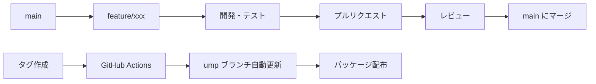

# Unity MCP Learning - ブランチ戦略設計

## 🎯 概要

Unity MCP Learning プロジェクトのGit URL配布に最適化されたブランチ戦略。開発の効率性、リリースの安全性、GitHub Actions自動化を考慮した設計。

## 🌳 ブランチ構造

### **メインブランチ**

#### `main` (開発ブランチ)
```
役割: メイン開発ライン
用途:
├─ 日常的な開発作業
├─ 機能追加・バグ修正
├─ ドキュメント更新
├─ 実験的機能テスト
└─ 開発者コラボレーション

保護レベル: 中程度
- プルリクエスト必須
- レビュー1名以上
- CI/CD パス必須
- 直接プッシュ禁止
```

#### `upm` (配布ブランチ)
```
役割: Unity Package Manager配布専用
用途:
├─ リリース版パッケージ配布
├─ ユーザー向けGit URL提供
├─ 安定版のみ配置
└─ 自動生成・更新

保護レベル: 最高
- 自動生成のみ（GitHub Actions）
- 手動プッシュ完全禁止
- タグベースでのみ更新
- 品質チェック完全通過必須
```

### **作業ブランチ**

#### `feature/*` (機能開発)
```
命名規則: feature/issue-number-brief-description
例: feature/123-mcp-auto-setup

用途:
├─ 新機能開発
├─ 大規模な機能追加
├─ 実験的機能実装
└─ 複数コミットが必要な作業

ライフサイクル:
1. mainから分岐
2. 機能実装
3. プルリクエスト作成
4. レビュー・マージ
5. ブランチ削除
```

#### `bugfix/*` (バグ修正)
```
命名規則: bugfix/issue-number-brief-description
例: bugfix/456-port-allocation-error

用途:
├─ バグ修正
├─ パフォーマンス問題解決
├─ セキュリティ問題対応
└─ 緊急修正

ライフサイクル:
1. mainから分岐
2. 問題修正
3. プルリクエスト作成
4. 緊急レビュー・マージ
5. ブランチ削除
```

#### `docs/*` (ドキュメント)
```
命名規則: docs/update-description
例: docs/add-installation-guide

用途:
├─ ドキュメント追加・更新
├─ README修正
├─ チュートリアル作成
└─ APIドキュメント更新

特徴:
- 軽量レビュープロセス
- 迅速なマージ優先
- CI/CDの一部スキップ可能
```

#### `hotfix/*` (緊急修正)
```
命名規則: hotfix/critical-issue-description
例: hotfix/server-crash-fix

用途:
├─ クリティカルバグの緊急修正
├─ セキュリティホールの即座対応
├─ 重大なパフォーマンス問題
└─ 本番環境障害対応

特別ルール:
- mainとumpブランチ両方への直接パッチ可能
- 緊急リリースプロセス適用
- 事後レビュー・検証必須
```

## 🔄 ワークフロー

### **通常開発フロー**



### **詳細ステップ**

#### 1. 機能開発開始
```bash
# 最新のmainを取得
git checkout main
git pull origin main

# 機能ブランチ作成
git checkout -b feature/123-new-feature

# 開発作業
git add .
git commit -m "feat: 新機能の実装"
git push origin feature/123-new-feature
```

#### 2. プルリクエスト作成
```markdown
## 概要
新機能XXXの実装

## 変更内容
- [x] 機能Aの追加
- [x] テストコード作成
- [x] ドキュメント更新

## テスト状況
- [x] ユニットテストパス
- [x] 統合テストパス
- [x] 手動テスト完了

## レビューポイント
- パフォーマンスへの影響
- セキュリティ考慮事項
```

#### 3. リリース準備
```bash
# mainブランチで最終チェック
git checkout main
git pull origin main

# バージョンタグ作成
git tag v1.2.0
git push origin v1.2.0

# GitHub Actionsが自動実行
# → umｐブランチ更新
# → パッケージ配布
```

## 🤖 GitHub Actions 自動化

### **自動ワークフロー**

#### `main` ブランチへのプッシュ
```yaml
name: Development CI/CD

on:
  push:
    branches: [ main ]
  pull_request:
    branches: [ main ]

jobs:
  test:
    runs-on: ubuntu-latest
    steps:
    - uses: actions/checkout@v3
    
    # Node.js環境セットアップ
    - uses: actions/setup-node@v3
      with:
        node-version: '20'
    
    # unity-mcp-nodeテスト
    - name: Test MCP Server
      run: |
        cd unity-mcp-node
        npm ci
        npm test
    
    # Unity関連テスト
    - name: Unity Tests
      run: |
        # Unity Test Runnerの実行
        echo "Unity tests would run here"
    
    # セキュリティチェック
    - name: Security Scan
      run: |
        # 機密情報スキャン
        # 依存関係脆弱性チェック
        echo "Security scans would run here"
    
    # コード品質チェック
    - name: Code Quality
      run: |
        # ESLint, Prettier
        # C# コード解析
        echo "Code quality checks would run here"
```

#### タグプッシュ時の自動リリース
```yaml
name: Package Release

on:
  push:
    tags:
      - 'v*'

jobs:
  create-upm-package:
    runs-on: ubuntu-latest
    
    steps:
    - uses: actions/checkout@v3
      with:
        submodules: recursive
        fetch-depth: 0
    
    # unity-mcp-nodeビルド
    - name: Build MCP Server
      run: |
        cd unity-mcp-node
        npm ci
        npm run build
        npm run test
    
    # UMPパッケージ準備
    - name: Prepare UMP Package
      run: |
        # 不要ファイル削除
        rm -rf .git
        rm -rf unity-mcp-node/node_modules
        rm -rf unity-mcp-node/.git
        rm -rf docs/development
        rm -rf docs/prompt
        rm -rf .github
        
        # バージョン更新
        VERSION=${GITHUB_REF#refs/tags/v}
        jq ".version = \"$VERSION\"" package.json > tmp.json
        mv tmp.json package.json
    
    # 品質最終チェック
    - name: Final Quality Check
      run: |
        # パッケージ構造検証
        # 依存関係確認
        # サイズチェック
        echo "Final quality checks"
    
    # UMPブランチ更新
    - name: Update UMP Branch
      run: |
        git config --global user.name "GitHub Actions"
        git config --global user.email "actions@github.com"
        
        git checkout -b ump
        git add -A
        git commit -m "UMP Release ${GITHUB_REF#refs/tags/}"
        
        git push origin ump --force
    
    # GitHub Release作成
    - name: Create GitHub Release
      uses: actions/create-release@v1
      env:
        GITHUB_TOKEN: ${{ secrets.GITHUB_TOKEN }}
      with:
        tag_name: ${{ github.ref }}
        release_name: Unity MCP Learning ${{ github.ref }}
        body: |
          ## 🚀 新機能・改善
          
          ### インストール方法
          1. Unity Package Manager を開く
          2. "+" → "Add package from git URL"  
          3. `https://github.com/${{ github.repository }}.git#ump` を入力
          
          ### 要件
          - Unity 6000.0+
          - Node.js 18+
          
          ### 主な変更点
          変更ログは [CHANGELOG.md](https://github.com/${{ github.repository }}/blob/main/CHANGELOG.md) をご確認ください。
        draft: false
        prerelease: false
```

## 🛡️ ブランチ保護ルール

### **`main` ブランチ保護**
```yaml
Protection Rules:
  - Require pull request reviews before merging: true
  - Required number of reviewers: 1
  - Dismiss stale reviews when new commits are pushed: true
  - Require status checks to pass before merging: true
  - Required status checks:
    - test
    - security-scan
    - code-quality
  - Require branches to be up to date before merging: true
  - Restrict pushes that create files in restricted paths: true
  - Block force pushes: true
  - Block deletions: true
```

### **`ump` ブランチ保護**
```yaml
Protection Rules:
  - Restrict pushes to matching branches: true
  - Allowed to push: GitHub Actions only
  - Block all human pushes: true
  - Block force pushes: true
  - Block deletions: true
  - Require signed commits: true
```

## 📋 運用ルール

### **コミットメッセージ規約**
```
種類(スコープ): 概要

例:
feat(mcp): MCPサーバー自動セットアップ機能追加
fix(ui): サーバー管理画面の表示エラー修正
docs(readme): インストール手順の更新
style(format): コードフォーマット調整
refactor(core): プロジェクトID生成ロジック改善
test(unit): MCPサーバー接続テスト追加
chore(deps): 依存関係の更新

種類:
- feat: 新機能
- fix: バグ修正
- docs: ドキュメント
- style: フォーマット
- refactor: リファクタリング
- test: テスト
- chore: その他
```

### **プルリクエストテンプレート**
```markdown
## 📝 概要
変更の概要を簡潔に説明してください

## 🔧 変更内容
- [ ] 追加した機能
- [ ] 修正したバグ
- [ ] 更新したドキュメント

## ✅ テスト状況
- [ ] ユニットテスト追加・パス
- [ ] 統合テスト実行・パス
- [ ] 手動テスト完了
- [ ] パフォーマンステスト実施

## 🔍 レビューポイント
特に注意してレビューしてほしい点

## 📸 スクリーンショット（UI変更の場合）

## 🔗 関連Issue
Closes #123
```

### **リリースノート自動生成**
```bash
# リリースノート自動生成スクリプト
#!/bin/bash

LAST_TAG=$(git describe --tags --abbrev=0)
CURRENT_TAG=$1

echo "## 🚀 ${CURRENT_TAG}"
echo ""
echo "### 新機能"
git log ${LAST_TAG}..HEAD --pretty=format:"- %s" --grep="feat"
echo ""
echo "### バグ修正"  
git log ${LAST_TAG}..HEAD --pretty=format:"- %s" --grep="fix"
echo ""
echo "### ドキュメント"
git log ${LAST_TAG}..HEAD --pretty=format:"- %s" --grep="docs"
```

## 🚦 品質ゲート

### **マージ前必須チェック**
```yaml
Pre-merge Checks:
  - コード品質スコア > 8.0/10
  - テストカバレッジ > 80%
  - セキュリティスキャン クリア
  - パフォーマンス劣化 < 5%
  - ドキュメント完備
  - レビュー承認 1名以上
```

### **リリース前必須チェック**
```yaml
Pre-release Checks:
  - 全自動テスト パス
  - 手動テスト 完了
  - セキュリティ監査 完了
  - パフォーマンステスト 合格
  - ドキュメント整合性 確認
  - バックアップ計画 準備
```

## 📈 メトリクス・監視

### **ブランチ健康度指標**
```csharp
// ブランチ状態監視
public class BranchHealthMetrics
{
    public Dictionary<string, float> GetBranchHealth()
    {
        return new Dictionary<string, float>
        {
            ["CommitFrequency"] = MeasureCommitFrequency(),
            ["PullRequestVelocity"] = MeasurePRVelocity(),
            ["CodeReviewTime"] = MeasureReviewTime(),
            ["BuildSuccessRate"] = MeasureBuildSuccessRate(),
            ["TestPassRate"] = MeasureTestPassRate(),
            ["SecurityIncidents"] = CountSecurityIncidents(),
            ["PerformanceRegression"] = MeasurePerformanceRegression()
        };
    }
}
```

---

**作成日**: 2025年6月8日  
**戦略**: 開発効率性・リリース安全性・自動化最適化  
**効果**: 品質保証・開発速度向上・運用負荷軽減

この戦略により、**安全で効率的な開発とリリースの両立**が実現されます。